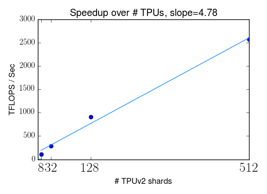
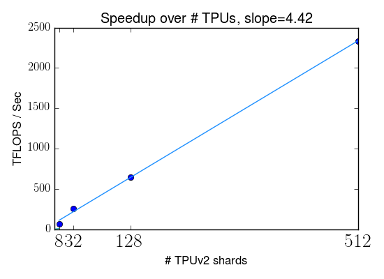

# Mesh TensorFlow - Model Parallelism Made Easier

Transformer for EN-FR WMT with model splitting |  Transformer for EN-FR WMT with data splitting
:-------------------------:|:-------------------------:
 | 

# Introduction

Mesh TensorFlow (mtf) is a language for distributed deep
learning, capable of specifying a broad class of distributed tensor
computations.  The purpose of mesh-tensorflow is to formalize and implement
distribution strategies for your computation graph over your hardware/processors
For example: "Split the batch over rows of processors and split
the units in the hidden layer across columns of processors." Mesh-TensorFlow is
implemented as a layer over TensorFlow.

## Do I need Mesh-TensorFlow?
If you just want data-parallel training (batch-splitting), then you do not need
mesh-tensorflow, though Mesh-TensorFlow can do this.  The most common reasons
for more sophisticated parallel computation are:

* The parameters of the model do not fit on one device - e.g. a
5-billion-parameter language model.

* An example is so large that the activations do not fit on one device. - e.g.
large images.  TODO(noam): we still need to implement spatially-partitioned
convolutions

* Lower-latency parallel inference (at batch size 1).

## The Mesh-TensorFlow Approach to Distributed Computation

* A "Mesh" is an n-dimensional array of processors, connected by a network.

* Each tensor is distributed (split and/or replicated) across all processors
  in a mesh.

* The "layout" of a tensor on a mesh is an injective partial map from the
  dimensions of the tensor to the dimensions of the mesh, specifying which
  dimensions of the tensor are split across which dimensions of the mesh.  An
  empty layout means that the tensor is fully replicated across all processors.

* Tensor dimensions and mesh dimensions are named.  The layouts of all tensors
  follow from a set of user-defined layout rules which specify which
  tensor-dimensions are split across which mesh-dimensions.  This ensures that
  the corresponding dimensions in different tensors are split in the same
  manner.

* Layouts do not affect results - only performance.

* The implementation of an operation involves parallel computation on all
  processors in the mesh, and sometimes also collective communication.  A
  processor usually just manipulates the slices of the input tensors already
  resident on that processor, and produces the slice of the output that goes on
  that processor.
  
## Example Models

This directory contains code for running several well-known models across
different tasks.

We outline an example below. In the above figures, Mesh-TensorFlow scales
linearly as the number of TPU shards increases. For model splitting, we varied
the number of hidden units in the feedforward layer and the number of heads; for
data splitting, we varied the batch size.

### Example Network (MNIST)

To illustrate, let us consider a simple model for the MNIST image-classification
task.  Our network has one hidden layer with 1024 units, and an output layer
with 10 units (corresponding to the 10 digit classes).  

The code consists of two parts, the first describing the mathematical
operations, and the second describing the devices and tensor/computation layout.
For the full example, see [`mnist.py`](mnist.py).
TODO(noam): verify that this code works.

```Python
# tf_images is a tf.Tensor with shape [100, 28, 28] and dtype tf.float32
# tf_labels is a tf.Tensor with shape [100] and dtype tf.int32
graph = mtf.Graph()
mesh = mtf.Mesh(graph, "my_mesh")
batch_dim = mtf.Dimension("batch", 100)
rows_dim = mtf.Dimension("rows", 28)
cols_dim = mtf.Dimension("cols", 28)
hidden_dim = mtf.Dimension("hidden", 1024)
classes_dim = mtf.Dimension("classes", 10)
images = mtf.import_tf_tensor(
    mesh, tf_images, shape=[batch_dim, rows_dim, cols_dim])
labels = mtf.import_tf_tensor(mesh, tf_labels, [batch_dim])
w1 = mtf.get_variable(mesh, "w1", [rows_dim, cols_dim, hidden_dim])
w2 = mtf.get_variable(mesh, "w2", [hidden_dim, classes_dim])
# einsum is a generalization of matrix multiplication (see numpy.einsum)
hidden = mtf.relu(mtf.einsum(images, w1, output_shape=[batch_dim, hidden_dim]))
logits = mtf.einsum(hidden, w2, output_shape=[batch_dim, classes_dim])
loss = mtf.reduce_mean(mtf_layers.softmax_cross_entropy_with_logits(
    logits, mtf.one_hot(labels, classes_dim), classes_dim))
w1_grad, w2_grad = mtf.gradients([loss], [w1, w2])
update_w1_op = mtf.assign(w1, w1 - w1_grad * 0.001)
update_w2_op = mtf.assign(w1, w1 - w1_grad * 0.001)
```

In the code above, we have built a mesh-tensorflow graph, which is simply
a Python structure.  We have completely defined the mathematical operations.
In the code below, we specify the mesh of processors and the layout of the
computation.

```Python
devices = ["gpu:0", "gpu:1", "gpu:2", "gpu:3"]
mesh_shape = [("all_processors", 4)]
layout_rules = [("batch", "all_processors")]
mesh_impl = placement_mesh_impl.PlacementMeshImpl(
    mesh_shape, layout_rules, devices)
lowering = mtf.Lowering(graph, {mesh:mesh_impl})
tf_update_ops = [lowering.lowered_operation(update_w1_op),
                 lowering.lowered_operation(update_w2_op)]
```

The particular layout above implements data-parallelism, splitting the batch of
examples evenly across all four processors.  Any Tensor with a "batch" dimension
(e.g. `images`, `h`, `logits`, and their gradients) is split in that dimension
across all processors, while any tensor without a "batch" dimension (e.g. the
model parameters) is replicated identically on every processor.

Alternatively, for model-parallelism, we can set
`layout_rules=[("hidden", "all_processors")]`.  In this case,
any tensor with a "hidden" dimension (e.g. `hidden`, `w1`, `w2`)  is split,
while any other tensor (e.g. `image`, `logits`) is fully replicated.

We can even combine data-parallelism and model-parallelism on a 2-dimensional
mesh of processors.  We split the batch along one dimension of the mesh, and the
units in the hidden layer along the other dimension of the mesh, as below.  In
this case, the hidden layer is actually tiled between the four processors, being
split in both the "batch" and "hidden_units" dimensions.

```Python
mesh_shape = [("processor_rows", 2), ("processor_cols", 2)]
layout_rules = [("batch", "processor_rows"), ("hidden", "processor_cols")]
```

## Where does the network communication happen?

Some mesh-tensorflow operations cause network communication.  For example, an
einsum (generalized matrix multiplication) is computed as follows:

* On each processor, compute the einsum of the slices of the two operands that
  are local to that processor.
* If no reduced-out dimensions are split, then we are done.
* If reduced-out dimensions are split, then perform an "allreduce" operation 
  on the resulting slices - summing across any mesh dimensions over which the
  reduced-out dimensions are split.

Where the allreduces happen depends will depend on the computation layout.
For example, in a data-parallel layout where the "batch" dimension is split,
allreduces will happen when computing the parameter gradients, since this
involves matrix multiplications which reduce out the "batch" dimension.

## How do I pick a layout?

While results do not depend on layout (except in the realm of roundoff errors
and random seeds), performance and memory consumption depend heavily on layout.
One day we hope to automate the process of choosing a layout.  For now, you
really need to fully understand the performance implications and pick one
yourself.  Mesh-tensorflow helps by accumulating and printing counters of
computation/communication.  To start, here are some tricks/guidelines.

* It is illegal for two dimensions of the same tensor to be split across the
  same batch dimension.
* For any compute-intense operation (e.g. einsum), make sure that all
  mesh-dimensions are used to split dimensions of the inputs or outputs.
  Otherwise, computation is duplicated.
* To keep the ratio of compute/commuication high (i.e. not be bandwidth-bound),
  split dimensions into large chunks.  This should be familiar in the
  data-parallelism case, where we want a large batch size per processor to avoid
  spending most of our time communicating.

# The Mesh-TensorFlow Language

Mesh-TensorFlow (v0.0) is implemented as a Python library which can generate
part of a TensorFlow graph.  The user first builds a `mtf.Graph` (the analog of
a TensorFlow graph) made up of `mtf.Tensor`s and `mtf.Operation`s.  As in
TensorFlow, this graph consists of simple Python objects.  The user then creates
a `mtf.Lowering` object, which lowers the `mtf.Graph` into TensorFlow, adding to
the default TensorFlow graph.

The Mesh-TensorFlow language is nearly identical to TensorFlow, with the
familiar notion of a Graph, Tensors, Operations, and automatic gradient
computation.  The principal differences are as follows:

## Meshes replace devices

A `Mesh` is a n-dimensional array of processors with named dimensions.  Each
`Tensor` is assigned to a `Mesh`, instead of a device.

## Tensor dimensions are named

Each `Tensor` has a static `Shape`, which is a tuple of different "Dimensions".
A `Dimension` is a `(name, size)` pair. For example, the shape of a `Tensor`
representing a batch of images might be:

`[("batch", 100), ("rows", 28"), ("cols", 28), ("channels", 3)]`.

## Layouts

A `Tensor` is laid out on its mesh with one slice on each processor.  A `Tensor`
"layout", is an injective partial map specifying which dimensions of the tensor
are (evenly) split across which dimensions of the mesh.  No dimension of a
tensor may be split across two dimensions of its mesh and no two dimensions of a
tensor may be split across the same dimension of its mesh.  The user defines a
global set of layout rules in the form of (tensor-dimension-name,
mesh-dimension-name) pairs.  A dimension of a tensor is split across a dimension
of its mesh if there is a matching rule.

### Example Layouts

Take our example `Tensor` `image_batch` with shape: 
`[("batch", 100), ("rows", 28"), ("cols", 28), ("channels", 3)]`

Assume that this `Tensor` is assigned to a mesh of 8 processors with shape:
`[("processor_rows", 2), ("processor_cols", 4)]`

* If we use an empty set of layout rules `[]`, we get no splitting.  Each
  processor contains the whole `Tensor`.

* If we use the layout rules `"batch:processor_cols"`, then the `"batch"`
  dimension of the `Tensor` is split across the `"processor_cols"` dimension of
  the batch.  This means that each processor contains a Tensor slice with shape
  `[25, 28, 28, 3]`.  For example, processors (0, 3) and (1, 3) contain
  identical slices - `image_batch[75:100, :, :, :]`.

* If we use the layout rules `"rows:processor_rows;cols:processor_cols"`, 
  then the image is split in two dimensions, with each processor containing one
  spatial tile with shape `[100, 14, 7, 3]`.   For example, processor (0, 1)
  contains the slice `image_batch[:, 0:14, 7:14, :]`.

Some layout rules would lead to illegal layouts:

* `"batch:processor_rows;rows:processor_rows"` is illegal because two tensor
  dimensions could be split across the same mesh dimension.

* `"channels:processor_rows"` is illegal because the size of the tensor
  dimension is not evenly divisible by the size of the mesh dimension.

## Einsum

Mesh-TensorFlow uses Einstein-summation notation, `mtf.einsum(inputs,
output_shape)`, using the (named) `Dimensions` as the symbols.  Matrix-
multiplication, broadcast, sum-reduction, and transposition can all be expressed
as special cases of `mtf.einsum`, though the familiar interfaces are also
supported.  The operation is lowered to slice-wise `tf.einsum`s, followed by
allreduce across any mesh-dimensions corresponding to the summed-out Tensor
dimensions.

## Reshape can be expensive

`mtf.reshape(x, new_shape)` is used to change a `Tensor`'s shape, potentially
leading to a new tensor layout and hence network communication.

# CPU/GPU/TPU implementations

Mesh-TensorFlow works on CPU, GPU and TPU.  The TPU implementation is very
different from the CPU/GPU implementation.

Multi-CPU/GPU meshes are implemented with `PlacementMeshImpl`.  In this case
mesh-tensorflow emits separate tensorflow operations placed on the different
devices, all in one big tensorflow graph.

TPU meshes are implemented in with `SimdMeshImpl`.  In this case,
mesh-tensorflow emits tensorflow operations (and communication collectives) from
the perspective of one core, and this same program runs on every core, relying
on the fact that each core actually performs the same operations.  This
piggy-backs on the TPU data-parallelism infrastructure, which operates the same
way.  This "SIMD" approach keeps the tensorflow and xla graphs from growing with
the number of cores.  The differences between cores are as follows:

* different slices of the variables (this works now)
* different positions in the collective communication (this works now)
* different slices of the infed and outfed tensors.  We currently work around
  this by requiring that all imported/exported tensors be fully-replicated.  In
  the future, we should handle this correctly.


# TODO LIST (please add items)

We are actively working on improving Mesh-TensorFlow in a variety of ways.  Some
of the top-priority items are:
`Contact us if you'd like to help!`

* Instructions for running on cloud-tpu.
* Operations necessary for spatial-partitioning (spatially-partitioned
  convolution, etc)
* Examples of image-classification models.
* Support for multiple meshes and efficient communication between them.  For
  example, we may want to load training data on a mesh of 64 cpu-machines and
  infeed them to a mesh of 512 tpu-cores.  We do not need this for language
  tasks where the data is tiny, but it will be important for other tasks.

